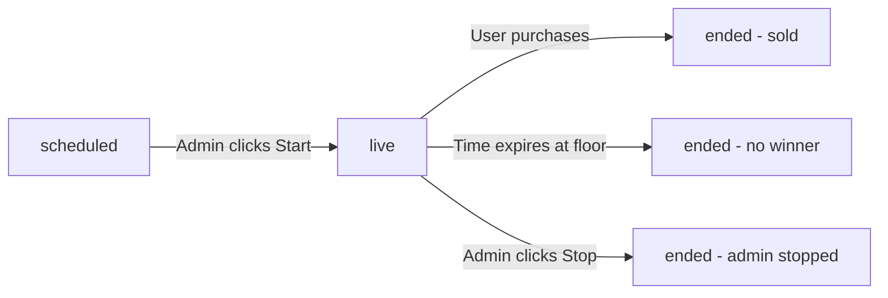

# Data Model: Sliding Auction Platform

**Version:** 1.0
**Date:** 2025-11-16
**Status:** Design Complete
**Related:** spec.md, plan.md

---

## Overview

This document defines the complete data model for the Sliding Auction Platform, including:
- Firestore document structures
- Realtime Database schema (presence detection)
- Validation rules
- State transitions
- Relationships and indexes

---

## Firestore Collections

### 1. `/auctions` Collection

**Purpose:** Store auction configurations and real-time state

**Document ID:** Auto-generated by Firestore
**Access:** Read (authenticated users), Write (admins only)

```typescript
interface Auction {
  // Identification
  id: string;                    // Auto-generated document ID

  // Item Details
  itemName: string;              // Max 100 characters, required
  itemDescription: string;       // Rich text HTML, max 2000 characters, required
  images: {
    full: string[];              // URLs to full-size images (1200px max width), 1-5 images
    thumbnails: string[];        // URLs to thumbnails (200x200px), matching full images
  };

  // Pricing Configuration
  startingPrice: number;         // In cents (e.g., 10000 = $100.00), min 1, required
  floorPrice: number;            // In cents, min 1, must be < startingPrice, required
  currentPrice: number;          // In cents, updated in real-time by Cloud Function
  duration: number;              // In seconds (60-7200, i.e., 1-120 minutes), required

  // Pricing Mode
  pricingMode: 'transparent' | 'algorithmic';  // required

  pricingConfig: {
    // Transparent Mode Fields (if pricingMode === 'transparent')
    formula?: 'linear' | 'exponential' | 'stepped';
    decayRate?: number;          // For linear: dollars per second, for exponential: rate constant

    // Algorithmic Mode Fields (if pricingMode === 'algorithmic')
    baseDecayRate?: number;      // 0.001 to 0.05 (0.1% to 5% per second)
    viewerMultiplier?: number;   // 0 to 2.0 (influence factor)
    shieldInfluence?: number;    // 0 to 2.0 (influence factor)
    timeRemainingAdjustment?: boolean;  // Enable acceleration near end
  };

  // State Management
  status: 'scheduled' | 'live' | 'ended - sold' | 'ended - no winner' | 'ended - admin stopped';
  startTime: Timestamp | null;   // Server timestamp when auction went live
  endTime: Timestamp | null;     // Server timestamp when auction ended
  winner: string | null;         // User ID (uid) of winner, null if no winner
  finalPrice: number | null;     // Price at which item sold (cents), null if not sold

  // Real-Time Metrics
  viewerCount: number;           // Current number of connected users (synced from Realtime DB)
  openShieldCount: number;       // Current number of users with shields open

  // Floor Price Handling
  floorReachedAt: Timestamp | null;  // When price first reached floor (starts 1-min timer)

  // Metadata
  createdAt: Timestamp;          // Server timestamp
  createdBy: string;             // Admin ID (for MVP: 'admin', post-MVP: individual admin UID)
  updatedAt: Timestamp;          // Server timestamp (updated on any change)
}
```

**Validation Rules:**
- `itemName`: Required, 1-100 characters
- `itemDescription`: Required, 1-2000 characters (HTML allowed, sanitized on display)
- `images.full`: Required, 1-5 URLs, must match Firebase Storage pattern
- `images.thumbnails`: Required, same length as `images.full`
- `startingPrice`: Required, >= 100 (minimum $1.00)
- `floorPrice`: Required, >= 100, must be < `startingPrice`
- `currentPrice`: Initialized to `startingPrice`, updated by Cloud Function only
- `duration`: Required, 60-7200 seconds
- `pricingMode`: Required, one of ['transparent', 'algorithmic']
- `status`: Managed by state machine (see State Transitions below)
- `viewerCount`: >= 0, updated from Realtime Database
- `openShieldCount`: >= 0, calculated from `/auctions/{id}/shields` subcollection

**Indexes:**
```javascript
// Composite index for querying active auctions
auctions: {
  status: 'asc',
  startTime: 'desc'
}

// Composite index for querying upcoming auctions
auctions: {
  status: 'asc',
  createdAt: 'desc'
}
```

**State Machine:**
```
scheduled → (admin clicks "Start") → live
live → (user purchases) → ended - sold
live → (time expires at floor) → ended - no winner
live → (admin clicks "Stop") → ended - admin stopped
```

---

### 2. `/auctions/{auctionId}/shields` Subcollection

**Purpose:** Track individual user shield states (who has shield open/closed)

**Document ID:** User UID
**Access:** Read (all authenticated users), Write (owner only, with cooldown validation)

```typescript
interface ShieldState {
  userId: string;                // Owner's UID (matches document ID)
  isOpen: boolean;               // true if shield currently open, false if closed/cooldown
  openedAt: Timestamp | null;    // Server timestamp when shield was opened (null if closed)
  closesAt: Timestamp | null;    // Server timestamp when shield will auto-close (openedAt + 5s)
  lastClosedAt: Timestamp | null; // Server timestamp when shield last closed (for cooldown calc)
}
```

**Validation Rules:**
- `userId`: Must match document ID and `request.auth.uid`
- `isOpen`: Boolean required
- `openedAt`: Required if `isOpen === true`, null otherwise
- `closesAt`: Required if `isOpen === true`, must equal `openedAt + 5 seconds`
- `lastClosedAt`: Required for cooldown enforcement (must be > 5 seconds ago to reopen)

**Lifecycle:**
1. User clicks "Open Shield" → Write `{ isOpen: true, openedAt: now, closesAt: now + 5s }`
2. After 5 seconds (client-side timer) → Write `{ isOpen: false, openedAt: null, closesAt: null, lastClosedAt: now }`
3. After 5-second cooldown → User can reopen (validation checks `now > lastClosedAt + 5s`)

**Cleanup:**
- On user disconnect (Realtime Database `.onDisconnect()` triggers Cloud Function)
- Cloud Function sets `{ isOpen: false, lastClosedAt: now }`

---

### 3. `/auctions/{auctionId}/priceHistory` Subcollection

**Purpose:** Store historical price points for graph visualization

**Document ID:** Auto-generated (timestamp-based for ordering)
**Access:** Read (all authenticated users), Write (Cloud Function only)

```typescript
interface PriceHistoryPoint {
  price: number;                 // Price in cents at this timestamp
  timestamp: Timestamp;          // Server timestamp when this price was set
  reason: 'base decay' | 'viewer surge' | 'shield activity' | 'time adjustment' | 'floor reached' | 'manual admin change';
}
```

**Validation Rules:**
- `price`: Required, >= auction.floorPrice, <= auction.startingPrice
- `timestamp`: Required, server timestamp
- `reason`: Required, one of allowed values

**Query Patterns:**
```javascript
// Fetch last 100 price points for graph
firestore.collection('auctions').doc(auctionId).collection('priceHistory')
  .orderBy('timestamp', 'asc')
  .limit(100)
  .get()
```

**Retention:**
- Keep all price points during active auction
- Post-auction: Optional cleanup after 30 days (not implemented in MVP)

---

### 4. `/auctions/{auctionId}/algorithmLog` Subcollection

**Purpose:** Admin-only log of algorithmic pricing decisions (for transparency/debugging)

**Document ID:** Auto-generated
**Access:** Read (admins only), Write (Cloud Function only)

```typescript
interface AlgorithmLogEntry {
  timestamp: Timestamp;          // When this decision was made
  decision: string;              // Human-readable decision (e.g., "Price adjusted -$50")
  reason: string;                // Detailed explanation (e.g., "High shield activity detected (8 shields open, threshold is 5)")
  priceBefore: number;           // Price in cents before adjustment
  priceAfter: number;            // Price in cents after adjustment
  factors: {
    viewerCount: number;         // Viewers at this timestamp
    openShields: number;         // Open shields at this timestamp
    timeRemaining: number;       // Seconds remaining
    baseDecay: number;           // Contribution from base decay (dollars)
    viewerAdjustment: number;    // Contribution from viewer multiplier (dollars)
    shieldAdjustment: number;    // Contribution from shield influence (dollars)
  };
}
```

**Usage:**
- Admin dashboard displays last 10 log entries in real-time
- Helps admins understand why price dropped/increased at specific moments
- Not visible to regular users (admin-only feature)

---

### 5. `/users` Collection

**Purpose:** Store user account data and fictional currency balances

**Document ID:** Firebase Auth UID
**Access:** Read (owner only), Write (Cloud Function only for balance, admin for grants)

```typescript
interface User {
  uid: string;                   // Firebase Auth UID (matches document ID)
  email: string;                 // From Firebase Auth
  balance: number;               // Fictional currency in cents, default 0
  createdAt: Timestamp;          // Account creation timestamp
  lastLogin: Timestamp;          // Last authentication timestamp (updated by Cloud Function)
}
```

**Validation Rules:**
- `uid`: Must match document ID
- `email`: Required, valid email format
- `balance`: Required, >= 0 (cannot go negative)
- `createdAt`: Required, server timestamp
- `lastLogin`: Required, server timestamp

**Initial Balance:**
- New users start with balance = 0
- Admins manually grant currency via admin panel

---

### 6. `/transactions` Collection

**Purpose:** Immutable ledger of all balance changes (purchases, admin grants, refunds)

**Document ID:** Auto-generated
**Access:** Read (owner only via userId), Write (Cloud Function only)

```typescript
interface Transaction {
  id: string;                    // Auto-generated document ID
  userId: string;                // UID of user this transaction belongs to
  type: 'purchase' | 'admin_grant' | 'refund';
  amount: number;                // In cents, negative for deductions, positive for grants
  balanceAfter: number;          // User's balance after this transaction (in cents)
  auctionId: string | null;      // Auction ID if type === 'purchase', null for grants
  itemName: string | null;       // Item name if type === 'purchase', null for grants
  timestamp: Timestamp;          // Server timestamp when transaction occurred
  description: string;           // Human-readable description (e.g., "Purchased Rare Vintage Watch")
  metadata?: {                   // Optional additional data
    grantedBy?: string;          // Admin UID if type === 'admin_grant'
    refundReason?: string;       // Reason if type === 'refund'
  };
}
```

**Validation Rules:**
- `userId`: Required, must be valid UID
- `type`: Required, one of ['purchase', 'admin_grant', 'refund']
- `amount`: Required, !== 0
- `balanceAfter`: Required, >= 0
- `timestamp`: Required, server timestamp
- `description`: Required, 1-200 characters

**Indexes:**
```javascript
// Query user's transaction history
transactions: {
  userId: 'asc',
  timestamp: 'desc'
}
```

**Immutability:**
- Transactions are never updated or deleted (audit trail)
- Balance recalculation: Sum all transactions for userId

---

## Firebase Realtime Database Schema

### 7. `/presence/{auctionId}/{userId}` Path

**Purpose:** Track online/offline status of users in auctions (for viewer count)

**Access:** Read (all authenticated), Write (owner only)

```typescript
interface PresenceState {
  online: boolean;               // true if user is connected
  timestamp: number;             // Server timestamp (milliseconds since epoch)
  lastHeartbeat?: number;        // Optional: Last heartbeat timestamp
}
```

**Lifecycle:**
1. User enters auction → Write `{ online: true, timestamp: ServerValue.TIMESTAMP }`
2. User navigates away → Write `{ online: false, timestamp: ServerValue.TIMESTAMP }`
3. User disconnects (network loss, tab close) → `.onDisconnect().remove()` deletes entry

**Cleanup:**
- `.onDisconnect()` automatically removes entry on disconnect
- Stale entries (heartbeat > 60s old) cleaned by Cloud Function every 5 minutes

---

### 8. `/auctionViewerCounts/{auctionId}` Path

**Purpose:** Aggregated viewer count for each auction (synced to Firestore)

**Access:** Read (all authenticated), Write (Cloud Function only)

```typescript
interface ViewerCount {
  count: number;                 // Total number of users with online: true in /presence/{auctionId}/
  lastUpdated: number;           // Server timestamp (milliseconds)
}
```

**Update Strategy:**
- Cloud Function listens to `/presence/{auctionId}/*` changes
- On any child add/remove → Recalculate count → Write to `/auctionViewerCounts/{auctionId}`
- Every 5 seconds, sync count to Firestore (`/auctions/{auctionId}.viewerCount`)

---

## State Transitions

### Auction Status State Machine



**Transition Rules:**

| From | To | Trigger | Validation |
|------|-----|---------|------------|
| `scheduled` | `live` | Admin clicks "Start Auction" | Auction must have all required fields, user is admin |
| `live` | `ended - sold` | User completes purchase | Purchase transaction succeeds (balance sufficient, shield open, auction still live) |
| `live` | `ended - no winner` | Time expires at floor | `now >= floorReachedAt + 60 seconds` |
| `live` | `ended - admin stopped` | Admin clicks "Stop Auction" | User is admin |

**Irreversible States:**
- Once auction reaches any "ended" state, it cannot return to `live` or `scheduled`
- Admins must create new auction to retry

---

## Validation Rules Summary

### Client-Side Validation (UX)

Performed before sending requests to server (immediate feedback):

1. **Auction Creation:**
   - All required fields present
   - Floor price < starting price
   - Duration 1-120 minutes
   - 1-5 images uploaded

2. **Purchase Attempt:**
   - User balance >= current price
   - Shield is open (client-side state check)

3. **Shield Open:**
   - Not in cooldown (client-side timer check)

### Server-Side Validation (Security)

Enforced by Firestore Security Rules and Cloud Functions:

1. **Firestore Security Rules:**
   - Only admins can create/update auctions
   - Users can only modify their own shield state
   - Shield cooldown enforced: `now > lastClosedAt + 5 seconds`
   - Users cannot modify balance (Cloud Function only)

2. **Cloud Function Validation (Purchase):**
   - Auction status is `live`
   - Shield is open (server timestamp check: `now >= openedAt && now <= closesAt`)
   - User balance >= current price
   - No other user has purchased (auction status check in transaction)

---

## Data Consistency Guarantees

### Atomic Operations

**Purchase Transaction (Firestore Transaction):**
```
Read: auction, user, shield
Validate: status === 'live', shield.isOpen === true, user.balance >= auction.currentPrice
Write:
  - auction.status = 'ended - sold'
  - auction.winner = userId
  - auction.finalPrice = currentPrice
  - user.balance = balance - currentPrice
  - transactions.add({ type: 'purchase', ... })
```
**Guarantee:** Either all writes succeed (user wins auction), or all writes fail (user sees error). No partial states.

**Shield State Integrity:**
- `openShieldCount` is calculated by counting documents in `/auctions/{id}/shields` where `isOpen === true`
- Cloud Function re-counts every 5 seconds and updates `auction.openShieldCount`
- Small delays (< 5s) acceptable (informational metric, not critical)

**Viewer Count Integrity:**
- Realtime Database `/auctionViewerCounts/{id}.count` is source of truth
- Synced to Firestore `/auctions/{id}.viewerCount` every 5 seconds
- `.onDisconnect()` ensures accurate count (removes stale users within ~30 seconds)

---

## Indexing Strategy

### Firestore Indexes

**Required Composite Indexes:**

1. **Active Auctions Query:**
   ```javascript
   Collection: auctions
   Fields: status (asc), startTime (desc)
   Query: .where('status', '==', 'live').orderBy('startTime', 'desc')
   ```

2. **Upcoming Auctions Query:**
   ```javascript
   Collection: auctions
   Fields: status (asc), createdAt (desc)
   Query: .where('status', '==', 'scheduled').orderBy('createdAt', 'desc')
   ```

3. **User Transaction History:**
   ```javascript
   Collection: transactions
   Fields: userId (asc), timestamp (desc)
   Query: .where('userId', '==', uid).orderBy('timestamp', 'desc')
   ```

**Single-Field Indexes (Auto-created):**
- `auctions.status`
- `auctions.startTime`
- `auctions.createdAt`
- `transactions.userId`
- `transactions.timestamp`

### Realtime Database Indexes

```json
{
  "rules": {
    "presence": {
      "$auctionId": {
        ".indexOn": ["online", "timestamp"]
      }
    }
  }
}
```

---

## Data Retention & Cleanup

### Active Auction Data
- **Keep:** All auction documents, shield states, price history during auction
- **Cleanup:** None (needed for real-time operation)

### Ended Auction Data
- **Keep (permanent):** Auction document, winner, final price
- **Keep (30 days):** Price history, algorithm log (for admin review)
- **Delete (immediate):** Shield states (no longer needed)

**Cleanup Cloud Function (Future):**
```javascript
// Run daily at midnight
exports.cleanupOldAuctions = functions.pubsub.schedule('0 0 * * *').onRun(async () => {
  const thirtyDaysAgo = Date.now() - (30 * 24 * 60 * 60 * 1000);

  const oldAuctions = await firestore.collection('auctions')
    .where('endTime', '<', thirtyDaysAgo)
    .get();

  const deletions = oldAuctions.docs.map(async (doc) => {
    // Delete subcollections
    await deleteCollection(doc.ref.collection('priceHistory'));
    await deleteCollection(doc.ref.collection('algorithmLog'));
    await deleteCollection(doc.ref.collection('shields'));
  });

  await Promise.all(deletions);
});
```

---

## Relationships Diagram

```
/users/{uid}
  ↓ (1:many)
/transactions (userId foreign key)

/auctions/{auctionId}
  ↓ (1:many)
/auctions/{auctionId}/shields/{userId}
  ↓ (1:many)
/auctions/{auctionId}/priceHistory/{id}
  ↓ (1:many)
/auctions/{auctionId}/algorithmLog/{id}

/users/{uid} ← (winner) /auctions/{auctionId}

Realtime DB:
/presence/{auctionId}/{userId}
  ↓ (aggregated by Cloud Function)
/auctionViewerCounts/{auctionId}
  ↓ (synced every 5s)
/auctions/{auctionId}.viewerCount (Firestore)
```

---

## Migration & Versioning

### Schema Version
**Current:** 1.0
**Stored in:** `/system/schemaVersion` (Firestore document)

```typescript
interface SchemaVersion {
  version: string;               // "1.0"
  lastMigration: Timestamp;      // When last migration ran
  changelog: string;             // Human-readable changes
}
```

### Future Migrations
- Add `version` field to auction documents
- Cloud Function checks version before processing
- Run migration script to backfill old documents

**Example (Future v2.0):**
- Add `auction.categories` field (tags like "Watches", "Art", etc.)
- Migration: Set `categories = []` for all existing auctions

---

## Security Considerations

### Personal Data (GDPR)
- **Personally Identifiable Information (PII):** Email address in `/users/{uid}.email`
- **Future:** Add `/users/{uid}/deleteRequest` for GDPR compliance (user requests data deletion)

### Sensitive Operations
- **Balance manipulation:** Only Cloud Functions can write to `user.balance`
- **Auction state changes:** Only admins (Security Rules) or Cloud Functions can change `auction.status`
- **Purchase validation:** Must use Firestore transaction (atomic check-and-set)

### Audit Trail
- **Transactions collection:** Immutable record of all balance changes
- **Algorithm log:** Records all pricing decisions (admin transparency)
- **Future:** Add admin action log (`/adminActions` collection tracking who created/started/stopped auctions)

---

**Status:** Data model complete ✅
**Next Steps:** Generate Firebase Security Rules and Cloud Functions API contracts
